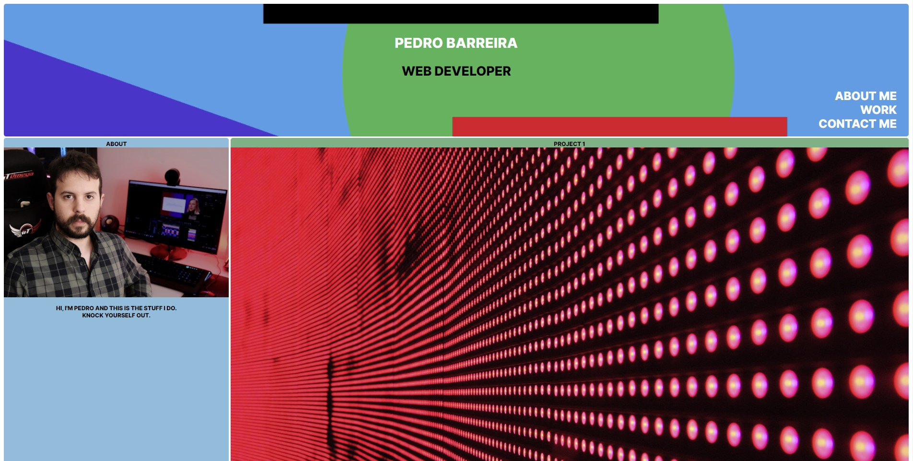
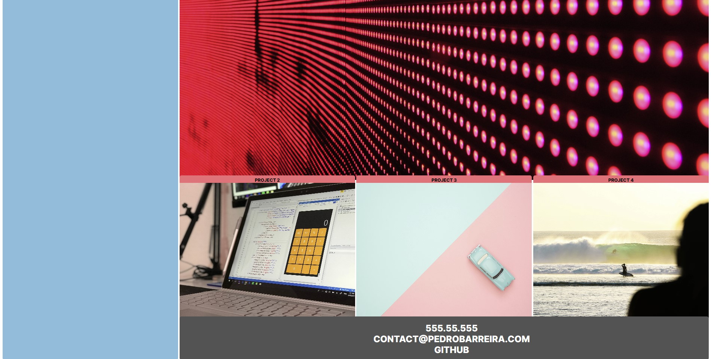

# WebDevPortfolio

## Description

In this project, I created a professional website portfolio where I showcase my web development projects to potential clients and employers.
This website is responsive and works in computers, tablets or smartphones, reacting and adapting to different screensizes for optimal display.
In the portfolio, I show a recent headshot of myself, an about me section, my most recent web development projects (placeholders for now), and a section that shows various contact details.

Link to the finished website: https://pedromiguel93.github.io/WebDevPortfolio/

## Screenshots

